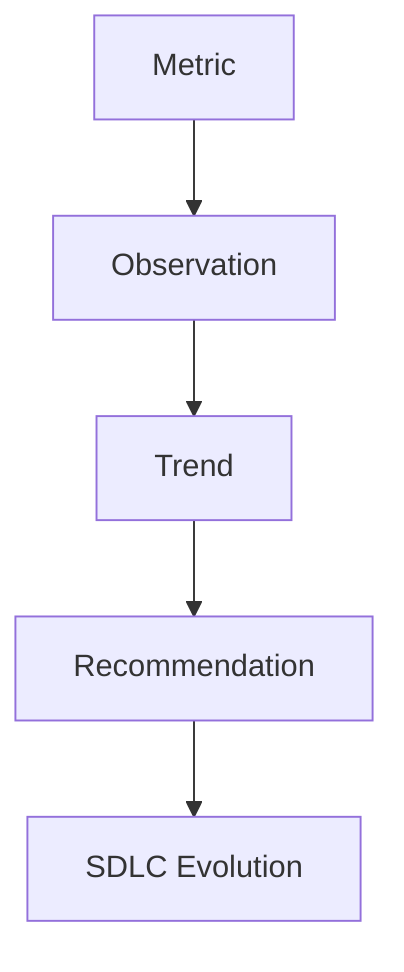

# Continuous Improvement Framework

This framework governs how engineering metrics influence the evolution of the AI SDLC.

## The Improvement Cycle

Continuous Improvement in the AI SDLC is a human-in-the-loop process. 

### 1. Metric
Raw, objective data collected during standard SDLC operations.

### 2. Observation
An analysis of the metric data over a specific period (e.g., "Architecture Review Pass Rate dropped by 15% this sprint").

### 3. Trend
Historical context demonstrating if the observation is an anomaly or a persistent pattern.

### 4. Recommendation
A proposed change to the Constitution, Standards, or Tooling to address the negative trend or capitalize on a positive one.

### 5. SDLC Evolution
The formal implementation of the recommendation via a version-controlled update to the SDLC framework.

## Strict Governance Policy

> **[IMPORTANT]**
> Metrics **never** automatically modify governance or policies.

- Automated systems may surface observations and propose recommendations.
- Only human stakeholders (e.g., Chief Architect, Engineering Management) can authorize and merge changes to the SDLC framework (`.ai-sdlc/`).
- Human decisions remain authoritative over all automated metric insights.
