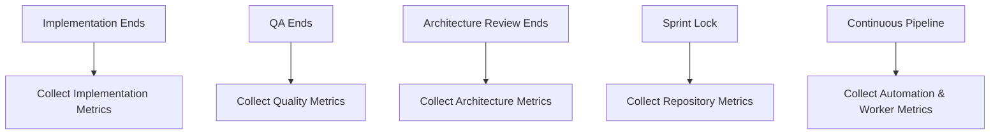

# Metric Collection Workflow

This document defines the lifecycle events that trigger the collection of specific engineering metrics.

## Collection Workflow

Metrics are collected observationally at designated milestones to avoid impeding engineering velocity.

## Milestone Triggers

### 1. Implementation Ends
- **Trigger:** Implementation plan executed and code committed.
- **Metrics Collected:** `M-IMPL-*` (Implementation Metrics).

### 2. QA Ends
- **Trigger:** Execution of verification plan and QA sign-off.
- **Metrics Collected:** `M-QUAL-*` (Quality Metrics).

### 3. Architecture Review Ends
- **Trigger:** Approval or rejection of an implementation plan by the Architecture Reviewer.
- **Metrics Collected:** `M-ARCH-*` (Architecture Metrics).

### 4. Sprint Lock
- **Trigger:** Formal closure of the sprint and generation of sprint artifacts.
- **Metrics Collected:** `M-REPO-*` (Repository Metrics).

### 5. Continuous Workflow
- **Trigger:** Background operations, worker invocations, and CI pipeline runs.
- **Metrics Collected:** `M-AUTO-*` (Automation Metrics), `M-WORK-*` (Worker Metrics).
